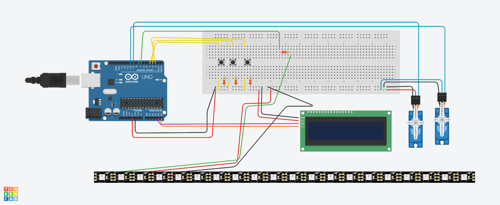

### What is this project about?
This code is used to run an Arduino-based ordering machine which demonstrates practical application of the principles of nudging to support sustainable meal choices.

### What components does this project use?
* Arduino Uno microcontroller board
* LCD display - shows the menu choices and functions as the screem
* LED stripe - displays green, yellow, and red colors (metaphorical traffic light) based on the interaction with the user on two vertical sides of the LCD display
* Three buttons - user's input
* Two servo motors (positional rotation and continuous) - mechanically display different nudging messages at different stages of user interaction by pushing them out

### Which code did this project get inspired by?
I learned the commands for specific components from the following videos:
* LCD display: [How to Use I2C LCD with Arduino | Very Easy Arduino LCD I2C Tutorial | Arduino 16x2 LCD I2C Tutorial](https://youtu.be/CvqHkXeXN3M?feature=shared) by Tronics lk
* LED stripe: [How To Control WS2812B Individually Addressable LEDs using Arduino](https://youtu.be/UhYu0k2woRM?feature=shared) by How To Mechatronics
* Servo motors: [How to Control a Servo With an Arduino](https://youtu.be/QbgTl6VSA9Y?feature=shared) by The Engineering Mindset
